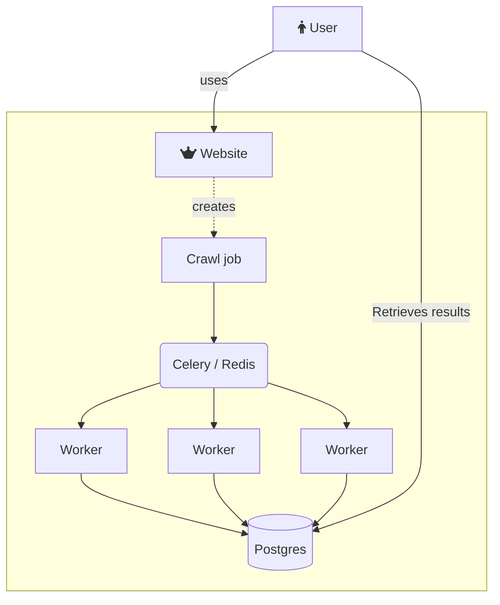

<link
  href="https://cdnjs.cloudflare.com/ajax/libs/font-awesome/6.6.0/css/all.min.css"
  rel="stylesheet"
/>
# Crawlers python

Distributed crawling backed by [Celery](https://docs.celeryq.dev/en/stable/). A user submit a crawl job and Celery handles everything with failover, retry, and stores the result in a redis.

## Main architecture



## Sequence of events
1. A crawl job is submitted. It contains a list of urls to crawl
2. A redis Set with the id = crawlJobId is created with all the urls to crawls
3. For each url to crawl we have one of those status ['UNFTECHED','FETCHED','FAILED']
4. Each URL to fetch is mapped a Celry Task


## Docker registry
Obtain a valid certificate for the registry and login to the registry:
```
> docker login https://docker.xtracted.io
```
Use [regctl](https://github.com/regclient/regclient/blob/main/docs/regctl.md) for anything related to the private docker registry


## Build redis worker
In order to build for arm64 and x86_64 arch we use docker buildx.
First we list the building nodes:
``` 
> docker buildx ls

NAME/NODE            DRIVER/ENDPOINT                   STATUS    BUILDKIT   PLATFORMS
local-builder*       docker-container
 \_ local-builder0    \_ unix:///var/run/docker.sock   running   v0.16.0    linux/amd64, linux/amd64/v2, linux/amd64/v3, linux/386
 \_ pi0               \_ ssh://nono@192.168.1.100      running   v0.16.0    linux/arm64, linux/arm/v7, linux/arm/v6
 \_ pi1               \_ ssh://nono@192.168.1.101      running   v0.16.0    linux/arm64, linux/arm/v7, linux/arm/v6
 \_ pi2               \_ ssh://nono@192.168.1.102      running   v0.16.0    linux/arm64, linux/arm/v7, linux/arm/v6
 \_ pi3               \_ ssh://nono@192.168.1.103      running   v0.16.0    linux/arm64*, linux/arm/v7*, linux/arm/v6*
default              docker
 \_ default           \_ default                       running   v0.15.2    linux/amd64, linux/amd64/v2, linux/amd64/v3, linux/386

```

Next we create a new build compatible with arm64 and x86_64 and push it to our local registry:
```sh
> eval $(ssh-agent)
> ssh-add ~/.ssh/git-rsa
> docker buildx build --platform linux/amd64,linux/arm64 --ssh default=$SSH_AUTH_SOCK -t docker.xtracted.io/xtracted-worker --push .
```
