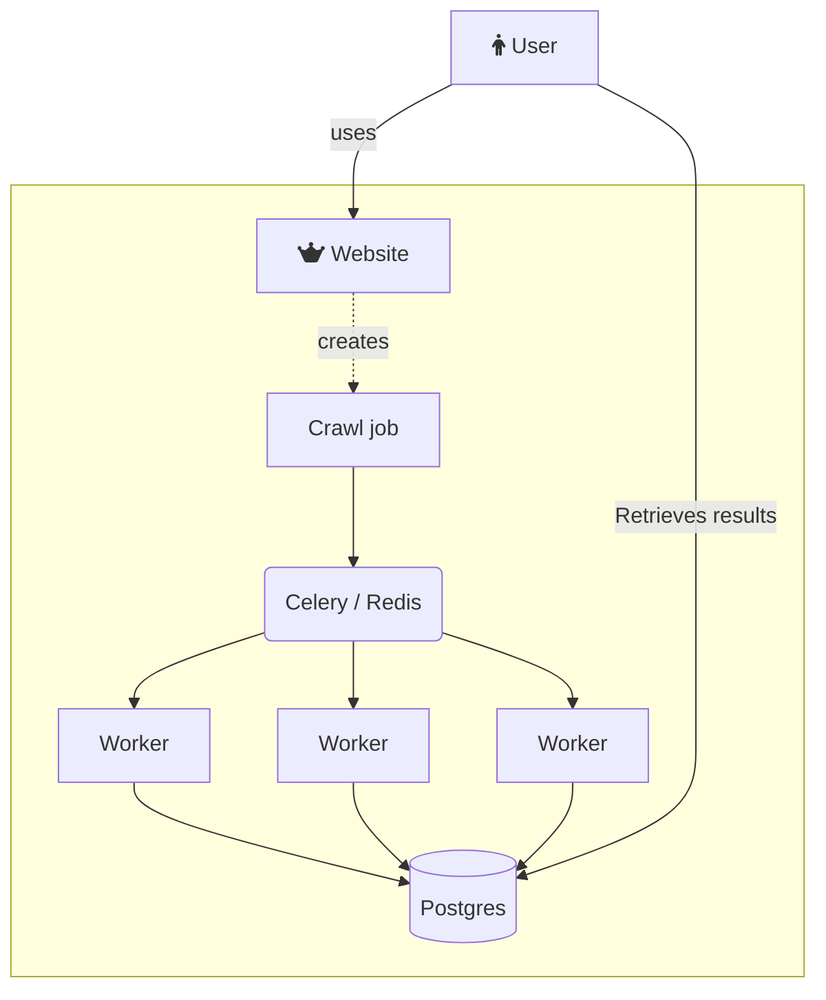

<link
  href="https://cdnjs.cloudflare.com/ajax/libs/font-awesome/6.6.0/css/all.min.css"
  rel="stylesheet"
/>
# Crawlers python

Distributed crawling backed by [Celery](https://docs.celeryq.dev/en/stable/). A user submit a crawl job and Celery handles everything with failover, retry, and stores the result in a redis.

## Main architecture

## Sequence of events
1. A crawl job is submitted. It contains a list of urls to crawl
2. A redis Set with the id = crawlJobId is created with all the urls to crawls
3. For each url to crawl we have one of those status ['UNFTECHED','FETCHED','FAILED']
4. Each URL to fetch is mapped a Celry Task
